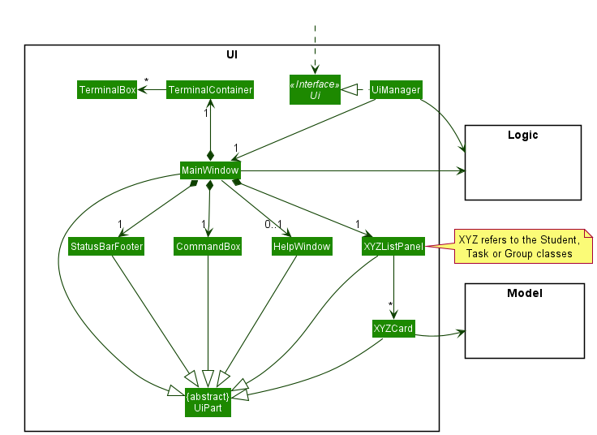
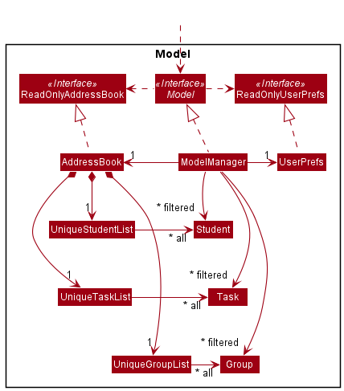
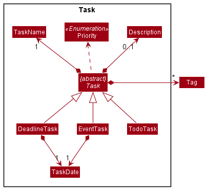
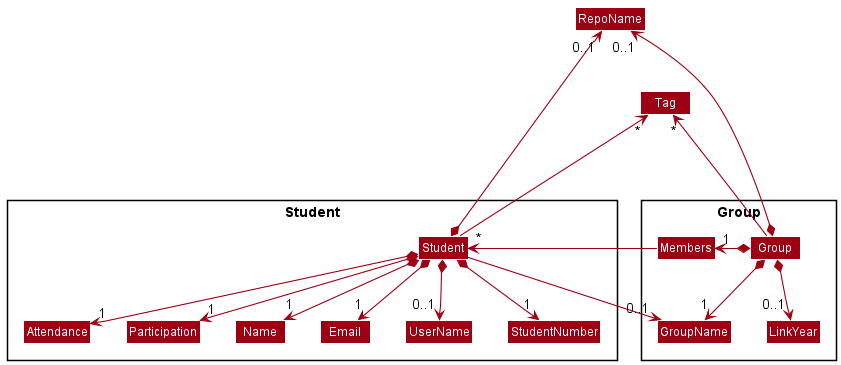
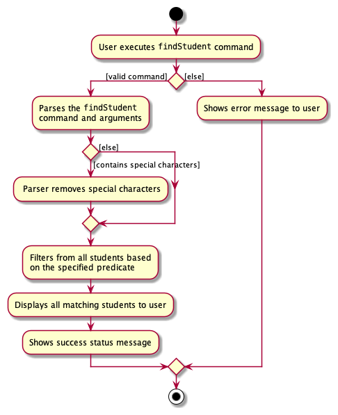
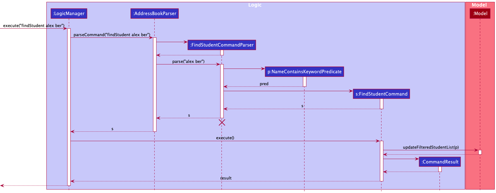
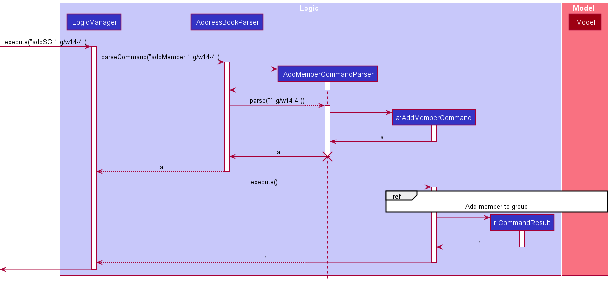
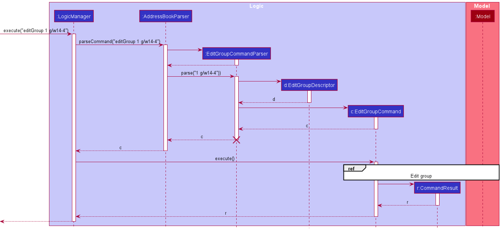
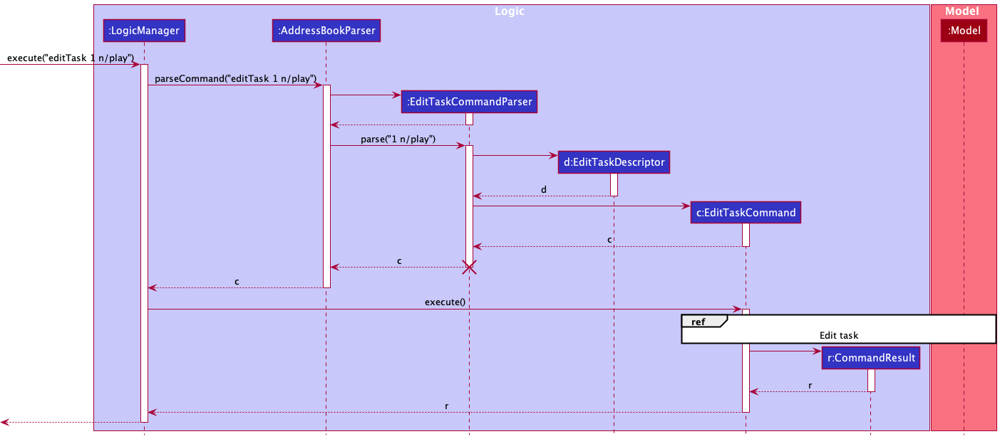
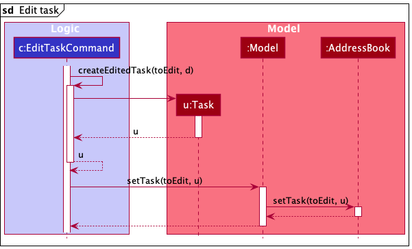

* Table of Contents 
{:toc}

--------------------------------------------------------------------------------------------------------------------

## **Acknowledgements**

* Format of this DG is based on [AB3 DG](https://se-education.org/addressbook-level3/DeveloperGuide.html)

--------------------------------------------------------------------------------------------------------------------

## **Setting up, getting started**

Refer to the guide [_Setting up and getting started_](SettingUp.md).

--------------------------------------------------------------------------------------------------------------------

## **Design**

### Architecture

The ***Architecture Diagram*** given above explains the high-level design of the App.

Given below is a quick overview of main components and how they interact with each other.

**Main components of the architecture**

**`Main`** has two classes called [`Main`](https://github.com/se-edu/addressbook-level3/tree/master/src/main/java/seedu/address/Main.java) and [`MainApp`](https://github.com/se-edu/addressbook-level3/tree/master/src/main/java/seedu/address/MainApp.java). It is responsible for,
* At app launch: Initializes the components in the correct sequence, and connects them up with each other.
* At shut down: Shuts down the components and invokes cleanup methods where necessary.

[**`Commons`**](#common-classes) represents a collection of classes used by multiple other components.

The rest of the App consists of four components.

* [**`UI`**](#ui-component): The UI of the App.
* [**`Logic`**](#logic-component): The command executor.
* [**`Model`**](#model-component): Holds the data of the App in memory.
* [**`Storage`**](#storage-component): Reads data from, and writes data to, the hard disk.

**How the architecture components interact with each other**

The *Sequence Diagram* below shows how the components interact with each other for the scenario where the user issues the command `deleteStudent 1`.

Each of the four main components (also shown in the diagram above),

* defines its *API* in an `interface` with the same name as the Component.
* implements its functionality using a concrete `{Component Name}Manager` class (which follows the corresponding API `interface` mentioned in the previous point.

For example, the `Logic` component defines its API in the `Logic.java` interface and implements its functionality using the `LogicManager.java` class which follows the `Logic` interface. Other components interact with a given component through its interface rather than the concrete class (reason: to prevent outside component's being coupled to the implementation of a component), as illustrated in the (partial) class diagram below.

The sections below give more details of each component.

### UI component

The **API** of this component is specified in [`Ui.java`](https://github.com/se-edu/addressbook-level3/tree/master/src/main/java/seedu/address/ui/Ui.java)

The UI consists of a `MainWindow` that is made up of parts e.g.`CommandBox`, `ResultDisplay`, `ListPanelPlaceholder`, `StatusBarFooter` etc. All these, including the `MainWindow`, inherit from the abstract `UiPart` class which captures the commonalities between classes that represent parts of the visible GUI.

The `XYZListPanel` is in turn made up of other parts e.g. `StudentListPanel`, `TaskListPanel`, `GroupListPanel`.

The `UI` component uses the JavaFx UI framework. The layout of these UI parts are defined in matching `.fxml` files that are in the `src/main/resources/view` folder. For example, the layout of the [`MainWindow`](https://github.com/se-edu/addressbook-level3/tree/master/src/main/java/seedu/address/ui/MainWindow.java) is specified in [`MainWindow.fxml`](https://github.com/se-edu/addressbook-level3/tree/master/src/main/resources/view/MainWindow.fxml)

The `UI` component,

* executes user commands using the `Logic` component.
* listens for changes to `Model` data so that the UI can be updated with the modified data.
* keeps a reference to the `Logic` component, because the `UI` relies on the `Logic` to execute commands and to determine the type of object to display in the `ListPanelPlaceholder`.
* depends on some classes in the `Model` component, as it displays either a `Student`, `Group`, or `Task` object residing in the `Model`.

#### XYZListPanel Component

The `XYZListPanel` consists of either a `StudentListPanel`, `TaskListPanel` or `GroupListPanel`.

Each of these `XYZListPanel`s consists of their own `XYZCard` components which make up the final GUI.

The layout of these `XYZListPanel`s are defined in matching `.fxml` files that are in the `src/main/resources/view` folder. For example, the layout of the [`MainWindow`](https://github.com/se-edu/addressbook-level3/tree/master/src/main/java/seedu/address/ui/MainWindow.java) is specified in [`MainWindow.fxml`](https://github.com/se-edu/addressbook-level3/tree/master/src/main/resources/view/MainWindow.fxml)

### Logic component

**API** : [`Logic.java`](https://github.com/se-edu/addressbook-level3/tree/master/src/main/java/seedu/address/logic/Logic.java)

Here's a (partial) class diagram of the `Logic` component:

How the `Logic` component works:
1. When `Logic` is called upon to execute a command, it uses the `AddressBookParser` class to parse the user command.
1. This results in a `Command` object (more precisely, an object of one of its subclasses e.g., `AddStudentCommand`) which is executed by the `LogicManager`.
1. The command can communicate with the `Model` when it is executed (e.g. to add a student).
1. The result of the command execution is encapsulated as a `CommandResult` object which is returned from `Logic`.

The Sequence Diagram below illustrates the interactions within the `Logic` component for the `execute("deleteStudent 1")` API call.

:information_source: **Note:** The lifeline for `DeleteStudentCommandParser` should end at the destroy marker (X) but due to a limitation of PlantUML, the lifeline reaches the end of diagram.

Here are the other classes in `Logic` (omitted from the class diagram above) that are used for parsing a user command:

How the parsing works:
* When called upon to parse a user command, the `AddressBookParser` class creates an `XYZCommandParser` (`XYZ` is a placeholder for the specific command name e.g., `AddStudentCommandParser`) which uses the other classes shown above to parse the user command and create a `XYZCommand` object (e.g., `AddCommand`) which the `AddressBookParser` returns back as a `Command` object.
* All `XYZCommandParser` classes (e.g., `AddStudentCommandParser`, `DeleteStudentCommandParser`, ...) inherit from the `Parser` interface so that they can be treated similarly where possible e.g, during testing.

### Model component
**API** : [`Model.java`]

The `Model` component,

* stores the address book data i.e., all `Student`, `Group` or `Task` objects (which are contained in a `UniqueStudentList`, `UniqueGroupList`, `UniqueTaskList` object respectively).
* stores the currently 'selected' objects (e.g., results of a search query) as a separate _filtered_ list which is exposed to outsiders as an unmodifiable `ObservableList<>` that can be 'observed' e.g. the UI can be bound to this list so that the UI automatically updates when the data in the list change.
* stores a `UserPref` object that represents the user’s preferences. This is exposed to the outside as a `ReadOnlyUserPref` objects.
* does not depend on any of the other three components (as the `Model` represents data entities of the domain, they should make sense on their own without depending on other components)

The class diagrams of the `Student`, `Task` and `Group` classes are shown below:

#####Task Component

#### Student and Group component

The `Student` component,

* stores the student's personal information as shown by composition in the diagram above.
* stores `Tag` and `RepoName` which are clases common to both `Student` and `Group` data types. `RepoName` in this case refers to the name of the student's IP repository.
* stores a reference to the `Group` the student is a part of via a unique `groupName` from the `Group` component (composition is not valid here as a `Group` can exist with an empty `Member` component). This attribute is not modifiable via teh regular `editStudent` command, and can only be modified internally when the student is added/deleted from a `Group`, or the `GroupName` of the student's group changes.

The `Group` component,

* stores group related information, similarly shown by compostition in the diagram above.
* stores `Tag` and `RepoName`. In this case, `RepoName` refers to the TP repository of the group.
* has a `Members` subcomponent that stores references to the `Student` component. This is initialized with no references to any `Student` to allow for preemptive creation of groups before members are made known. 

:information_source: **Note:** An alternative (arguably, a more OOP) model is given below. It has a `Tag` list in the `AddressBook`, which `XYZ` references. This allows `AddressBook` to only require one `Tag` object per unique tag, instead of each `XYZ` object needing their own `Tag` objects. 

### Storage component

**API** : [`Storage.java`](https://github.com/se-edu/addressbook-level3/tree/master/src/main/java/seedu/address/storage/Storage.java)

The `Storage` component,
* can save both address book data and user preference data in json format, and read them back into corresponding objects.
* inherits from both `AddressBookStorage` and `UserPrefStorage`, which means it can be treated as either one (if only the functionality of only one is needed).
* depends on some classes in the `Model` component (because the `Storage` component's job is to save/retrieve objects that belong to the `Model`)

### Common classes

Classes used by multiple components are in the `seedu.addressbook.commons` package.

--------------------------------------------------------------------------------------------------------------------

## **Implementation**

This section describes some noteworthy details on how certain features are implemented.

### Find Command

The find command can be executed for two main features in tApp: students and groups.

#### Implementation

Given below is an example usage scenario and how the find mechanism behaves at each step.
In this example, we explore the `findStudent` command.

The following diagram shows the workflow of a typical FindStudent command.

When the user executes the `findStudent` command, the user input is parsed to separate the command and its arguments. Special characters are removed during this parsing step. Students are then searched based on the specified arguments.
During the execution of `FindStudentCommand`, the student list will be filtered based on the predicate created from the arguments.

The following steps describes the execution of the FindStudent command, assuming no errors are encountered.

1. The user executes a `findStudent alex ber` command to find students whose names contain the name word `alex` or `ber`.
1. `LogicManager` handles this command by calling its `execute(String)` method.
1. `LogicManager` then calls and passes this command to `AddressBookParser` to parse the command through its `parseCommand(String)` method.
1. The `AddressBookParser` creates a new `FindStudentCommandParser` which will parse the arguments `parse(alex ber)`. This in turns create a new `NameContainsKeywordPredicate` instance that checks if a `Student` contains the predicates `alex` or `ber`.
1. A new `FindStudentCommand` is created by `FindStudentCommandParser` and is returned to `LogicManager` with the predicate as one of its fields.
1. The `LogicManager` calls the `execute()` method in `FindStudentCommand`.
1. The `FindStudentCommand` calls the `Model#updateFilteredStudentList()` method, passing in the previously returned predicate as its argument.
1. The filtered student list is updated by checking all the students in the filtered students list with the `NameContainsKeywordPredicate` instance.
1. In this case, the filtered student list should return the students: Alex and Bernice as in the sample data.
1. A new `CommandResult` is returned, switching the current display to the filtered student list. The result is returned to `LogicManager`.

The above process is further summarised in the following sequence diagram:

ℹ️ **Note:** The lifeline ****for `FindStudentCommandParser`, `FindStudentCommand`, `NameContainsKeywordPredicate` should end at the destroy marker (X) but due to a limitation of PlantUML, the lifeline reaches the end of diagram.

### Add Member to Group Command

The add member command can be executed to form an association between two main data types in tApp, Groups and Students.

#### Implementation

As with all other commands in tApp, the addMember feature is activated when a user enters the `addMember` command word followed by its relevant arguments.
The main difference between the addMember command lies not in the way the `Logic` class is activated but in the way the `Model` class processes this command.

When the user executes the `addMember` command, user input is parsed and the `Index` of student to be added, and the `GroupName` of the group to be added to are extracted into parameters of the `AddMemberCommand` class.

If any errors are present in the user input, exceptions are thrown in the following components, summarised in the following activity diagram:

1. `AddMemberCommandParser` throws an exception if command format is invalid (negative/missing index, missing group prefix)
1. `AddMemberCommand` throws an exception if the `Index` does not exist in the student list, `GroupName` is does not belong to any preexisting `Group`. It also throws an exception if the student is already in another group, or the student has already been added to the current group. 
The workflow for throwing these exceptions is similar to the first two and is not shown in the activity diagram below.

The interaction between the `Logic` and `Model` classes are shown in the following sequence diagram:

A key difference to note about this command is that gets a list of both `Students` and `Groups` from models, instead of only 1 list as per other commands.

The follow steps describes the execution of the AddMember command:

1. `AddMemberCommand` uses the provided `Index` and `GroupName` to obtain both a reference to the `Student` (using `Index`) and the `Group` (using `GroupName`). Since `GroupName` is unique, there will only be one `Group` selected.
1. `AddMemberCommand` then uses these references to call the `addMembers` function of the `Model` class.
1. The `Model` then creates and stores a new `Student` using the same information as the `Student` parameter passed in, but substituting the `GroupName` field to the name of the `Group` passed as a parameter.
1. `Model` then calls the `addMember` function of the referenced `Group`, passing in the newly created `Student` as a parameter.
1. `Group` then calls the `addMember` function of its `Member` class, passing in the same `Student` parameter.
1. The `Member` then stores a reference to this `Student`.
1. `Model` then calls `setStudent` and `setGroup` to update these changes in `AddressBook`.
1. Execution of this command then follows the usual execution path of all other commands in tApp.

Unlike other commands which only changes itself in the `Model` class, `addMembers` updates both the `Student` to be added and the `Group` to which the student is added to, and saves both
these changes in the `AddressBook`. 

#### Design considerations:

* Alternative 1 (selected implementation): Have `Members` save a list of `Student` and `Student` have a reference to `GroupName`
    * Pros: Easy to implement, all relevant student information can be readily accessed and displayed in the GUI.
    * Cons: Increases coupling between `Student` and `Group` classes.

* Alternative 2: Have `Members` save the `Name` of students and `Student` have a reference to `Group`
    * Pros: Smaller JSON file size due to smaller volume of information being referenced to.
    * Cons: Increases coupling between `Student` and `Group` classes, need to find the relevant `Student` object given its `Name` everytime the `Group` is to be displayed in the GUI,
      unnatural modelling of the real world since `Group` contains students and not the other way around.

* Alternative 3: Have `Members` save the `Name` of students only
    * Pros: Smaller JSON file size due to smaller volume of information being referenced to, lesser coupling due to only a unidirectional association.
    * Cons: Unable to display the `GroupName` of a `Student` in the student display list using simple code implementation, reduction in input validation capabilities (assigning 1 student to 2 groups) since there is no direct way to determine if a `Student` is already in a group.

### Edit Group Command

#### Implementation

The Edit Group feature is activated when a user enters the `editGroup` command word followed by its relevant arguments.
When the user executes the `editGroup` command, user input is parsed and the fields to be edited are extracted into an `EditGroupDescriptor` object.
The `EditGroupDescriptor` object and the `Index` of the group to be edited are then extracted into parameters of the `EditGroupCommand` class.
The `EditGroupCommand` then interacts with the `Model` class to edit the data.

The implementations of the other Edit commands, namely the `EditTaskCommand` and the `EditStudentCommand`, are similar to the `EditGroupCommand` in the way the `Logic` component behaves.
However, the behaviour of the `Model` component differs slightly for the `EditGroupCommand`, as it alters not only the `Group` data, but also the `Student` data in the `AddressBook`.

This process is shown in the following sequence diagram:

The following steps describe the execution of the `EditGroupCommand`.

1. `EditGroupCommand` uses the provided `Index` and `EditGroupDescriptor` to create the updated `Group` object.
2. `EditGroupCommand` then calls the `setGroup` method of the `Model` class to replace the previous `Group` object with the newly updated one.
3. `Model` then updates all `Student` objects that are part of the `Members` class of the group. This is achieved by creating new `Student` objects that have the updated `Group` object as a field, and calling the `setStudent` method of `AddressBook` to update the `Student data`.
4. Finally, `Model` calls the `setGroup` function of the `AddressBook` to update the `Group` data.

## Edit Task Command

#### Implementation

The Edit Task feature is activated when a user enters the `editTask` command word followed by its relevant arguments.
When the user executes the `editTask` command, user input is parsed and the fields to be edited are extracted into an `EditTaskDescriptor` object.
The `EditTaskDescriptor` object and the `Index` of the task to be edited are then extracted into parameters of the `EditTaskCommand` class.
The `EditTaskCommand` then interacts with the `Model` class to edit the data.

The implementations of the other Edit commands, namely the `EditGroupCommand` and the `EditStudentCommand`, are similar to the `EditTaskCommand` in the way the `Logic` component behaves.
However, the behaviour of the `Model` component differs slightly for the `EditTaskCommand`, as it alters only the `Task` data in the `AddressBook`.

This process is shown in the following sequence diagram:

The following steps describe the execution of the `EditTaskCommand`.

1. `EditTaskCommand` uses the provided `Index` and `EditTaskDescriptor` to create the updated `Task` object.
2. `EditTaskCommand` then calls the `setTask` method of the `Model` class to replace the previous `Task` object with the newly updated one.
3. Finally, `Model` calls the `setTask` function of the `AddressBook` to update the `Task` data.

### Tasks

tApp allows TAs to manage their tasks for his or her professional or personal use.

The different types of lists include:
1. Todo Tasks - Just a task to be completed in the future
2. Deadline - A task to be completed in the future by a specified deadline
3. Event - A task to be completed on a specified date

Common commands for the task model:

* `add` - Creates a new task item
* `edit` - Modifies an existing task
* `delete` - Removes an existing task from the list of tasks
* `list` - Shows all tasks in the list
* `clear` - Removes all the tasks in the list

#### Rationale

The tApp is supposed to cater to TA, who are very busy. They have their own modules to prepare for and as well as prepare for weekly tutorial sessions. Hence, they have lots of things to keep track and a task manager feature is necessary. And there are primarily 3 types of tasks - todos, deadlines and events. tApp has supports all of these features to assist TAs in performing their tasks more efficiently and accurately.

#### Current Implementation

To adhere to Object Oriented Programming priciples, we have decided to make the `Task` class as the parent class and `TodoTasks`, `DeadlineTask` and `EventTask` classes a subclass of `Task` class. The class diagram below shows in detail how the task model is being implemented.

**Insert Tasks Class Diagram**

#### Adding Todo Task

Given below is an example usage scenario and how the adding a todo task mechanism behaves at each step.

1. The user executes the `todo n/Complete tp p/H t/CS2103 t/Work` do add a Todo Task named 'Complete tp' with the tags
   'CS2103' and 'Work' to the list of tasks and marks this task as High Priority.
2. The command is handled by `LogicManager#execute(String)`, which then calls and passes this command to the `AddressBookParser#parseCommand(String)` method.
3. The `AddressBookParser` detects the command word `todo` in the string and extracts the argument string `n/Complete tp p/H t/CS2103 t/Work`.
4. The `AddressBookParser` creates a new `AddTodoTaskCommandParser` instance to parse the argument string according to the format specified for `AddTodoTaskCommand`.
5. The argument string is parsed to create new tags and keep them in a `Set<Tags>` and the Priority of the task is set to high. These are done using the `AddTodoTaskCommandParser#parse(String)` method, which also performs validation.
6. The `AddTodoTaskCommandParser` creates a new `AddTodoTaskCommand` and returns it to AddressBookParser, which in turn returns it to `LogicManager`.
7. The LogicManager calls the `AddTodoTaskCommand#execute(Model)` method.
8. The AddTodoTaskCommand calls the `Model#addTask(Task)` method.
9. The tasks is added to the list of tasks and the updated list of task is displayed.
9. Lastly, the `AddTodoTaskCommand` creates a `CommandResult` with a success message and returns it to `LogicManager`.

The above process is shown in the following sequence diagram:

**Sequence diagram showcasing the add todo task process**

The following activity diagram summarizes what happens when a user executes a new command to find the members by keywords:

**Activity diagram showcasing the  add todo task execution flow**

--------------------------------------------------------------------------------------------------------------------

## **Documentation, logging, testing, configuration, dev-ops**

* [Documentation guide](Documentation.md)
* [Testing guide](Testing.md)
* [Logging guide](Logging.md)
* [Configuration guide](Configuration.md)
* [DevOps guide](DevOps.md)

--------------------------------------------------------------------------------------------------------------------

## **Appendix: Requirements**

### Product scope

**Target user profile**:

This product is for CS2103/T TAs who are:
* Familiar with command line and code
* Worried about using too many applications to manage his students' projects and grades.
* Able to tolerate a steep learning curve
* Disorganized, forgetful
* Busy with other school projects and modules

**Value proposition**:

TAs are required to complete different tasks (mark attendance and participation, track tp progress) and manage multiple groups and students.

This application aims to integrate different tasks into a centralised platform that can improve a TA’s efficiency. It helps to ensure instructors complete all tasks by stipulated deadlines.

### User stories

Priorities: High (must have) - `* * *`, Medium (nice to have) - `* *`, Low (unlikely to have) - `*`

| Priority | As a …​          | I want to …​                                      | So that I can…​                                                     |
| -------- | ------------------- | ---------------------------------------------------- | ---------------------------------------------------------------------- |
| `* * *`  | user                | add a task with time                                 | be reminded of when certain tasks are due                              |
| `* * *`  | user                | delete tasks                                         | not be cluttered with completed/wrong tasks                            |
| `* * *`  | user                | mark students' attendance                            | keep track of who is present                                           |
| `* * *`  | user                | mark tasks as complete                               | know which tasks have already been done                                |
| `* * *`  | user                | view my todo list                                    | know what tasks I have to do                                           |
| `* * *`  | user                | view my student list                                 | know what students I have                                              |
| `* * *`  | user                | add a student contact                                | add my student into the list                                           |
| `* * *`  | user                | delete a student contact                             | remove my student if he quits the course                               |
| `* * *`  | user                | store my data in a file                              | easily export data from the application                                |
| `* * *`  | user                | add GitHub links for each student contact            | easily access their Github to check their progress                     |
| `* * *`  | user                | add GitHub links for each student group              | easily access their Github to check their progress                     |
| `* * *`  | user                | record participation during tutorials                | accurately award participation marks to students                       |
| `* * *`  | user                | add descriptions to the tasks                        | see the extra detail pertaining to the task                            |
| `* *`    | user                | set my current directory to either students or tasks | add students/tasks more easily                                         |
| `* *`    | user                | access the ‘help’ page with all available commands   | refer to instructions when I forget how to use tApp                    |
| `* *`    | user                | allocate students to different groups                | track their progress based on their groups                             |
| `* *`    | user                | import data from CSV files                           | get started with the app quickly                                       |
| `* *`    | user                | edit tasks                                           | correct any errors I made without deleting and creating a new task     |
| `* *`    | user                | search for a student                                 | quickly access all information related to the student                  |
| `* *`    | user                | search for a group                                   | quickly access all information related to the group                    |
| `* *`    | user                | purge all current students                           | start a new semester with new students                                 |
| `* *`    | user                | purge all current groups                             | start a new semester with new groups                                   |
| `* *`    | user                | purge all current tasks                              | get rid of all my tasks                                                |
| `* *`    | user                | purge all current data                               | get rid of sample data I used for exploring the app                    |
| `* *`    | user                | sort groups & students by their tP / iP progress     | see who needs help                                                     |
| `* *`    | expert user         | sort tasks by earliest deadline                      | know what tasks need to be completed urgently                          |
| `* *`    | user                | specify default tasks to add when adding students    | I do not need to manually add the same tasks                           |
| `* *`    | user                | create tags to be added to tasks                     | easily access the links related to the task                            |
| `* *`    | user                | tag students to specific tasks                       | keep track of students related to a task                               |
| `* *`    | user                | create events as a type of task                      | keep track of tasks that occur at a specified time                     |
| `* *`    | expert user         | view the changes I made to my todo list              | recover tasks that are accidentally deleted                            |
| `* *`    | user                | set automated reminders upon startup                 | not forget any task                                                    |
| `*`      | expert user         | create command line shortcuts to access tasks        | easily access data and save time                                       |
| `*`      | user                | set recurring tasks                                  | not create tasks that I have to complete regularly                     |
| `*`      | user                | customise the order of the menu                      | easily access the features I use most                                  |
| `*`      | user                | broadcasts task to a certain group                   | efficiently add new module wide tasks                                  |
| `*`      | user                | assign priority levels for tasks                     | what tasks require my earliest attention                               |
| `*`      | user                | string multiple commands into a single line          | manage my tasks more efficiently                                       |
| `*`      | user                | view both my students’ tasks and my own tasks        | be informed of the week’s progress                                     |
| `*`      | expert user         | create custom commands                               | make managing tasks more convenient, and more tailored to my needs     |
| `*`      | user                | filter the CS2103/T textbook                         | refresh my memory on concepts I forgot                                 |

### Use cases

(For all use cases below, the **System** is `tApp` and the **Actor** is the `user`, unless specified otherwise)

**Use case: UC1 - View student list**

**MSS**

1.  User requests to list all students
2.  tApp displays the list of students

    Use case ends.

**Extensions**

* 1a. User is already in the student directory.

  Use case resumes at step 3.

* 2a. The list is empty.

  Use case ends.

**Use case: UC2 - Add a student**

**MSS**

1.  User requests to view students (UC1)
2.  tApp displays the list of students
3.  User requests to add a student contact
4.  tApp adds the student

    Use case ends.

**Extensions**

* 3a. No name is specified.

    * 3a1. tApp shows an error message.

      Use case ends.

**Use case: UC3 - Edit a student**

**MSS**

1.  User requests to view students (UC2)
2.  tApp displays the list of students
3.  User requests to delete a specific student in the list
4.  tApp deletes the student

    Use case ends.

**Extensions**

* 2a. The student list is empty.

  Use case ends.

* 3a. The given index is invalid.

    * 3a1. tApp shows an error message.

      Use case resumes at step 2.

**Use case: UC4 - Delete a student**

**MSS**

1.  User requests to view students (UC1)
2.  tApp displays the list of students
3.  User requests to delete a specific student in the list
4.  tApp deletes the student

    Use case ends.

**Extensions**

* 2a. The student list is empty.

  Use case ends.

* 3a. The given index is invalid.

    * 3a1. tApp shows an error message.

      Use case resumes at step 2.

**Use case: UC5 - Mark student as present**

**MSS**

1.  User requests to view students (UC1)
2.  tApp lists all students
3.  User requests to mark a specific student as present in the list
4.  tApp marks the student as present

    Use case ends.

**Extensions**

* 2a. The student list is empty.

  Use case ends.

* 2b. User requests to mark a specific student as absent in the list.

    * 2b1. tApp marks the student as absent.

      Use case ends.

* 3a. The given index is invalid.

    * 3a1. tApp shows an error message.

      Use case resumes at step 2.

**Use case: UC6 - Mark student as participated**

Similar to UC5, except the student's participation is marked instead of attendance.

**Use case: UC7 - Find student by name**

**MSS**

1.  User requests to find student whose name is John
2.  tApp displays all names containing 'john'

    Use case ends.

**Extensions**

* 2a. The student list is empty.

    * 2a1. tApp displays an empty list

      Use case ends.

**Use case: UC8 - Clear student list**

**MSS**

1.  User requests to view students (UC1)
2.  tApp displays the list of students
3.  User requests clear the student list
4.  tApp clears the student list

    Use case ends.

**Extensions**

* 2a. The student list is empty.

  Use case ends.

**Use case: UC9 - View group list**

**MSS**

1.  User requests to view the list of groups
2.  tApp displays all groups

    Use case ends.

**Extensions**

* 2a. The group list is empty.

    * 2a1. tApp displays an empty list

      Use case ends.

**Use case: UC10 - Add a group**

**MSS**

1.  User requests to create a group with the specified name
2.  tApp creates the group and stores it in the group list
3.  tApp displays all groups

    Use case ends.

**Extensions**

* 1a. The group name is empty.

    * 1a1. tApp displays an error message stating that the group name is invalid and to follow the correct format

  Use case ends.

* 1b. The group name is invalid.

    * 1b1. tApp displays an error message stating that the group name is invalid and to follow the correct format

  Use case ends.

**Use case: UC11 - Edit a group**

**MSS**

1.  User requests to view the list of groups
2.  tApp displays all groups
3.  User requests to edits a specific group from the list of groups
4.  tApp edits the group
5.  tApp displays all groups with the edited group

    Use case ends.

**Extensions**

* 2a. The list is empty.

  Use case ends.

* 3a. The given index is invalid.

    * 3a1. tApp shows an error message.

      Use case resumes at step 2.

**Use case: UC12 - Delete a group**

Similar to UC11 (Edit a group), except the group is deleted instead of edited.

**Use case: UC13 - Add student to group**

**MSS**

1.  User requests to view the list of students
2.  tApp displays all the students
3.  User requests to add a specific student from the list of students to a specific group from the list of groups
4.  tApp adds the student to the group

    Use case ends.

**Extensions**

* 3a. The group name is empty or invalid.

    * 3a1. tApp displays an error message stating that the group name is invalid and to follow the correct format

      Use case ends.

* 3b. The student index is empty or invalid.

    * 3b1. tApp displays an error message stating that the command format is invalid and to follow the correct format

      Use case ends.

* 3c. The group name is valid but the group does not exist.

    * 3c1. tApp displays an error message stating that the group does not exist

      Use case ends.

* 3d. The student index is valid but the student does not exist.

    * 3d1. tApp displays an error message stating that the student already has a group

      Use case ends.

**Use case: UC13 - Delete student from group**

Similar to UC12 (Add student to group), except we are deleting the student from the group, and group index and member list index is used instead of group name and student list index.

**Use case: UC14 - Find groups by name**

Similar to UC7 (Find student by name), except we are finding groups by group name.

**Use case: UC15 - Clear group list**

Similar to UC8 (Clear student list), except we are clearing the group list.

**Use case: UC16 - View task list**

**MSS**

1.  User requests to view the list of tasks
2.  tApp displays all tasks

    Use case ends.

**Extensions**

* 2a. The task list is empty.

    * 2a1. tApp displays message that there are no tasks

      Use case ends.

**Use case: UC17 - Add a todo task**

**MSS**

1.  User requests to create a todo task
2.  tApp creates the todo and stores it in the task list
3.  tApp displays the task list with the task that was just created

    Use case ends.

**Extensions**

* 1a. The task name is empty.

    * 1a1. tApp displays an error message stating that the task name is invalid

      Use case ends.

* 1b. The command format is incorrect.

    * 1b1. tApp displays an error message requesting the user to follow the correct format

  Use case ends.

**Use case: UC18 - Add a task with a specified deadliine**

**MSS**

1.  User requests to create a task with a specified deadline
2.  tApp creates the task and stores it in the task list
3.  tApp displays the task list with the task that was just created

    Use case ends.

**Extensions**

* 1a. The task name is empty.

    * 1a1. tApp displays an error message stating that the task name is invalid

      Use case ends.

* 1b. The format of the deadline is incorrect.

    * 1b1. tApp displays an error message requesting the user to follow the correct deadline format

      Use case ends.

**Use case: UC19 - Add a task with a specified event date**

Similar to UC18, except the deadline is an event date.

**Use case: UC20 - Edit a task**

**MSS**

1.  User requests to view the list of tasks
2.  tApp displays all the tasks currently in the list
3.  User requests to edit a specific task from the list of tasks
4.  tApp edits the task
5.  tApp displays the task list

    Use case ends.

**Extensions**

* 2a. The list is empty.

  Use case ends.

* 3a. The given index is invalid.

    * 2a1. tApp shows an error message.
      Use case resumes at step 2.

**Use case: UC21 - Delete a task**

Similar to UC20 (Edit a task), except the task is deleted instead of edited.

**Use case: UC22 - Mark a task as done**

Similar to UC20 (Edit a task), except the task is marked as done instead of edited.

**Use case: UC23 - Clear task list**

Similar to UC8 (Clear student list), except we are clearing the task list.

**Use case: UC24 - Clear all entries in tApp**

Similar to UC8 (Clear student list), except we are clearing the whole address book.

### Non-Functional Requirements
* Should work on any _mainstream OS_ as long as it has Java `11` or above installed.
* Should be able to hold up to 1000 students without a noticeable sluggishness in performance for typical usage.
* A user with above average typing speed for regular English text (i.e. not code, not system admin commands) should be able to accomplish most of the tasks faster using commands than using the mouse.
* Commands used should be intuitive, and should not exceed 80 characters.
* System should respond almost immediately upon entering a command.
* Error messages shown should inform the user of what is wrong and what the correct command syntax should be.

### Glossary

* **Mainstream OS**: Windows, Linux, Unix, OS-X
* **Student contact**: A student entry with the corresponding student’s name, tutorial attendance, and tutorial participation.
* **Task**: An entry with a textual description of a piece of work to do, and a time that specifies the date that piece of work should be completed by
* **Directory**: The list commands entered will be applied to (either student or task)

--------------------------------------------------------------------------------------------------------------------

## **Appendix: Instructions for manual testing**

Given below are instructions to test the app manually.

:information_source: **Note:** These instructions only provide a starting point for testers to work on;
testers are expected to do more *exploratory* testing.

### Launch and shutdown

1. Initial launch

    1. Download the jar file and copy into an empty folder

    1. Double-click the jar file.
       Expected: Shows the GUI with a set of sample students. The window size may not be optimum.

1. Saving window preferences

    1. Resize the window to an optimum size. Move the window to a different location. Close the window.

    1. Re-launch the app by double-clicking the jar file. 
       Expected: The most recent window size and location is retained.

## Student

### Adding a student

1. Adding a student while all students are being shown

    1. Prerequisites: List all students using the `students` command. Multiple students in the list.
    
    1. Test case: `addStudent n/John Doe e/john@u.nus.edu s/a0000001b u/johndoee r/ip` 
       Expected: A student is added to the bottom of the list, with Github link shown. Details of the student is shown in the status message. Letters in student number are automatically capitalized.

    1. Test case: `addStudent n/John Doe e/jondoe@u.nus.edu s/a0000002b u/jondoee r/ip`    
       Expected: Similar to previous, no error thrown, student with same name added.
       
    1. Test case: `addStudent n/Mary Doe e/mary@u.nus.edu s/a0000001b` or any other student with conflicting student number or email 
       Expected: No student is added. Error message of duplicate student shown in status message.
       
    1. Test case: `addStudent` with missing `n/`, `e/`, and/or `s/` prefixes  
       Expected: No student is added. Error message of invalid command format shown.
       
2. Adding a student while on another directory
    
    1. Prerequisites: List all tasks or groups using the `tasks` or `groups` command.
    
    1. Perform a successful `addStudent` command
       Expected: A student is added, and the student list is displayed. 
    

### Deleting a student

1. Deleting a student while all students are being shown

    1. Prerequisites: List all students using the `students` command. Multiple students in the list.

    1. Test case: `deleteStudent 1` 
       Expected: First contact is deleted from the list. Details of the deleted contact shown in the status message.

    1. Test case: `deleteStudent 0` 
       Expected: No student is deleted. Error details shown in the status message.

    1. Other incorrect delete commands to try: `deleteStudent`, `deleteStudent x`, `...` (where x is larger than the list size) 
       Expected: Similar to previous.

### Editing a student

1. Editing a student while all students are being shown

    1. Prerequisites: List all students using the `students` command. Multiple students in the list.

    1. Test case: `editStudent 1 n/John Doe u/johndoee r/ip` 
       Expected: The first student in the list has details changed to the ones specified above. Details of the student is shown in the status message.
       
    1. Test case: `editStudent 1 s/a0000001b` or any other student number or email or both to that conflicts with another student in the list    
       Expected: No student is edited. Error message of duplicate student shown in status message.

    1. Test case: `editStudent 999 n/test` where the index is greater than the number of students in the list.
       Expected: No student is edited. Error message invalid index shown. 

    1. Test case: `editStudent 1` with no prefixes  
       Expected: No student is edited. Error message of missing edit fields shown.
    
   1. Test case: `editStudent 0 n/test`, where the index is 0 or smaller  
      Expected: No student is edited. Error message of invalid command format shown.
      
2. Editing a student while on another directory

    1. Prerequisites: List all tasks or groups using the `tasks` or `groups` command.

    1. Perform a successful `editStudent` command
       Expected: The student is edited, and the student list is displayed.

### Marking a student's attendance

1. Marking a student while all students are being shown

    1. Prerequisites: List all students using the `students` command. Multiple students in the list.

    1. Test case: `marka 1 w/1` 
       Expected: First contact is marked as present in the list. Status message shows details of his week 1 attendance.

    1. Test case: `marka 0 w/1` 
       Expected: No student is marked. Error details shown in the status message.

    1. Other incorrect mark attendance commands to try: `marka`, `marka x`, `...` (where x is larger than the list size) 
       Expected: Similar to previous.

1. Marking a student while on another directory

    1. Prerequisites: Perform a `findStudent` command: e.g. `find David`.

    1. Test case: `marka 1 w/1` 
       Expected: First contact in the last filtered students list (David) is marked as present. Status message shows details of student's week 1 attendance. Updated students list is shown.

    1. Test case: `marka 1 w/1` 
       Expected: First contact in student list (Alex) is marked as present/absent depending on his last attendance status. Status message shows details of student's week 1 attendance. Updated students list is shown.

1. Marking multiple students

    1. Test case: `marka 1 2 3 w/1` 
       Expected: Students 1, 2 and 3 are marked as present in the list. Status message shows details of their week 1 attendance.

    1. Test case: `marka 1 2 3 w/1` 
       Expected: Students 1, 2 and 3 are marked as absent in the list. Status message shows details of their week 1 attendance.

### Marking a student's participation

1. Marking a student while all students are being shown

    1. Prerequisites: List all students using the `students` command. Multiple students in the list.

    1. Test case: `markp 1 w/1` 
       Expected: First contact is marked as participated in the list. Status message shows details of his week 1 participation.

    1. Test case: `markp 0 w/1` 
       Expected: No student is marked. Error details shown in the status message.

    1. Other incorrect mark participation commands to try: `markp`, `markp x`, `...` (where x is larger than the list size) 
       Expected: Similar to previous.

1. Marking a student while on another directory

    1. Prerequisites: Perform a `findStudent` command: e.g. `find David`.

    1. Test case: `markp 1 w/1` 
       Expected: First contact in the last filtered students list (David) is marked as participated. Status message shows details of student's week 1 participation. Updated students list is shown.

    1. Test case: `markp 1 w/1` 
       Expected: First contact in student list (Alex) is marked as participated/not participated depending on his last participation status. Status message shows details of student's week 1 participation. Updated students list is shown.

1. Marking multiple students

    1. Test case: `markp 1 2 3 w/1` 
       Expected: Students 1, 2 and 3 are marked as participated in the list. Status message shows details of their week 1 participation.

    1. Test case: `markp 1 2 3 w/1` 
       Expected: Students 1, 2 and 3 are marked as not participated in the list. Status message shows details of their week 1 participation.

### Finding a student

1. Finding a student while all students are being shown

    1. Prerequisites: List all students using the `students` command. Multiple students in the list.

    1. Test case: `findStudent al` 
       Expected: Students whose name contains "al" will be shown (e.g. Alex). Status message shows how many students has been found.

    1. Test case: `findStudent !alex! ben123` 
       Expected: Students whose name contains "alex" OR "ben" will be shown (e.g. Alex, Ben). Special characters and numbers ignored. Status message shows how many students has been found.

    1. Other incorrect findStudent commands to try: `findStudent`, `findStudent !`  
       Expected: No student found. Error details shown in the status message.

1. Finding a student while in another directory

   Expected: Similar to previous.

### Clearing student list

1. Clearing the student list

    1. Test case: `clearStudents` 
       Expected: All students cleared from student list. Existing students in groups will also be cleared, leaving empty groups.

## Groups

### Adding a group

1. Adding a group while all groups are being shown

    1. Prerequisites: List all groups using the `groups` command. Multiple groups in the list.

    1. Test case: `addGroup g/w14-4 y/AY2122S1 r/tp` 
       Expected: A group is added to the bottom of the list, with Github link shown. Details of the group is shown in the status message. Letter in group name is automatically capitalized.

    1. Test case: `addGroup g/w14-4` or any other group with conflicting name 
       Expected: No group is added. Error message of duplicate group shown in status message.

    1. Test case: `addGroup` with missing `g/` prefixes (other prefixes can be present)  
       Expected: No student is added. Error message of invalid command format shown.

2. Adding a group while on another directory

    1. Prerequisites: List all students or groups using the `students` or `groups` command.

    1. Perform a successful `addGroup` command
       Expected: A group is added, and the group list is displayed.

### Deleting a group

1. Deleting a group while all groups are being shown

    1. Prerequisites: List all groups using the `groups` command. Multiple groups in the list.

    1. Test case: `deleteGroup 1` 
       Expected: First group is deleted from the list. Details of the deleted group shown in the status message. Members of the group in student list are no longer tagged to the group.

   1. Test case: `deleteGroup 999` where the index of the group is greater than the size of the group list 
      Expected: No group is deleted. Error message of invalid index shown in the status message.

    1. Test case: `deleteGroup 0` 
       Expected: No group is deleted. Error message of invalid command format shown in the status message.

    1. Other incorrect delete commands to try: `deleteGroup`, `deleteGroup x`, `...` (where x is smaller than 0) 
       Expected: Similar to previous.

### Editing a group

1. Editing a group while all groups are being shown

    1. Prerequisites: List all groups using the `groups` command. Multiple groups in the list.

    1. Test case: `editGroup 1 r/ip` 
       Expected: The first group in the list has details changed to the ones specified above. Details of the group is shown in the status message.

    1. Test case: `editGroup g/w14-4` changing group name a value conflicting another group in the list    
       Expected: No group is edited. Error message of duplicate group shown in status message.

    1. Test case: `editGroup 999 n/test` where the index is greater than the number of groups in the list.
       Expected: No group is edited. Error message invalid index shown.

    1. Test case: `editGroup 1` with no prefixes  
       Expected: No group is edited. Error message of missing edit fields shown.

    1. Test case: `editStudent 0 n/test`, where the index is 0 or smaller  
       Expected: No student is edited. Error message of invalid command format shown.

2. Editing a student while on another directory

    1. Prerequisites: List all tasks or students using the `tasks` or `students` command.

    1. Perform a successful `editGroup` command
       Expected: The group is edited, and the group list is displayed.

### Adding a group member

1. Adding a group member while all groups are being shown

    1. Prerequisites: List all groups using the `groups` command. Multiple groups in the list.

    1. Test case: `addMember 1 g/w14-4` where a group with the name of W14-4 exists 
       Expected: First student in the student list is added to group W14-4 as a member. Success message shown in the status message. Student in student list is tagged to the group.

    1. Test case: `addMember 999 g/w14-4` where the index of the student is greater than the size of the student list 
       Expected: No member is added. Error message of invalid index shown in the status message.

    1. Test case: `addMember 2 g/z11-1` where no group with name Z11-1 exists 
       Expected: No member is added. Error message of invalid group name shown in the status message. 

    1. Test case: `addMember 0 g/w14-4` 
       Expected: No group is deleted. Error message of invalid command format shown in the status message.

    1. Other incorrect delete commands to try: `addMember`, `addMember x g/w14-4`, `...` (where x is smaller than 0) 
       Expected: Similar to previous.

### Deleting a group member

1. Deleting a group member while all groups are being shown

    1. Prerequisites: List all groups using the `groups` command. Multiple groups in the list.

    1. Test case: `deleteMember 1 1` where the first group has at least 1 member 
       Expected: First student in the member list of the first group in the group list is deleted. Success message shown in the status message. Student in student list is no longer tagged to the group.

    1. Test case: `deleteMember 999 1` where the index of the group is greater than the size of the group list 
       Expected: No member is deleted. Error message of invalid group index shown in the status message.

    1. Test case: `deleteMember 1 99` where the index of the member is greater than the size of the member list exists 
       Expected: No member is deleted. Error message of invalid member index shown in the status message.

    1. Test case: `deleteMember 0 1` 
       Expected: No member is deleted. Error message of invalid command format shown in the status message.

    1. Other incorrect delete commands to try: `deleteMember`, `deleteMember x y`, `...` (where x and/or y are smaller than 0) 
       Expected: Similar to previous.

### Finding a group

1. Finding a group while all groups are being shown

    1. Prerequisites: List all groups using the `groups` command. Multiple groups in the list.

    1. Test case: `findGroup w14` 
       Expected: Groups whose name contains "w14" will be shown (e.g. W14-4). Case-insensitive. Status message shows how many groups has been found.

    1. Test case: `findGroup w14 w15-2` 
       Expected: Groups whose name contains "w14" OR "w15-2" will be shown (e.g. W14-2, W14-4, W15-2). Ignores all special characters except dashes. Case-insensitive. Status message shows how many groups has been found.

    1. Other incorrect findGroup commands to try: `findGroup`, `findGroup !`  
       Expected: No groups found. Error details shown in the status message.

1. Finding a group while in another directory

   Expected: Similar to previous.

### Clearing group list

1. Clearing the group list

    1. Test case: `clearGroups` 
       Expected: All groups cleared from group list. Existing students in groups will be removed from their group (students will have no group).

## Tasks

### Adding a todo task

1. Adding a todo task while all tasks are being shown.

    1. Prerequisites: List all groups using the `tasks` command. Multiple tasks in the list.

    1. Test case: `todo n/Prepare for Tutorial` 
       Expected: Creates a new todo task named "Prepare for Tutorial", adds it to the list of tasks and displays all the tasks.

    1. Test case: `todo n/Prepare for Tutorial by/2021-11-01` 
       Expected: No new todo task created. Error details shown in the status message.

    1. Other incorrect findGroup commands to try: `todo`, `todo !`  
       Expected: No new todo task created. Error details shown in the status message.

1. Adding a todo task while in another directory

   Expected: Similar to previous.

### Adding a deadline task

1. Adding a deadline task while all tasks are being shown.

    1. Prerequisites: List all groups using the `tasks` command. Multiple tasks in the list.

    1. Test case: `deadline n/Prepare for Tutorial by/2021-11-01` 
       Expected: Creates a new deadline task named "Prepare for Tutorial" with a deadline "2021-11-01",
       and adds it to the list of tasks and displays all the tasks.

    1. Test case: `deadline n/Prepare for Tutorial` 
       Expected: No new deadline task created. Error details shown in the status message.

    1. Other incorrect findGroup commands to try: `deadline n/Prepare for Tutorial on/2021-11-01`,
       `deadline`, `deadline !`  
       Expected: No new todo task created. Error details shown in the status message.

1. Adding a deadline task while in another directory

   Expected: Similar to previous.

### Adding an event task

1. Adding an event task while all tasks are being shown.

    1. Prerequisites: List all groups using the `tasks` command. Multiple tasks in the list.

    1. Test case: `event n/Conduct Tutorial on/2021-11-01` 
       Expected: Creates a new deadline task named "Conduct Tutorial" on "2021-11-01",
       and adds it to the list of tasks and displays all the tasks.

    1. Test case: `event n/Conduct Tutorial` 
       Expected: No new deadline task created. Error details shown in the status message.

    1. Other incorrect findGroup commands to try: `event n/Conduct Tutorial by/2021-11-01`,
       `event`, `event !`  
       Expected: No new todo task created. Error details shown in the status message.

1. Adding a event task while in another directory

   Expected: Similar to previous.

### Editing a task

1. Editing a task while all tasks are being shown

    1. Prerequisites: List all tasks using the `tasks` command. Multiple tasks in the list.

    1. Test case: `editTask 1 n/Tutorial p/high d/Covers important topics for finals.` 
       Expected: The first task in the list has details changed to the ones specified above. Details of the task is shown in the status message.
    
    1. Test case: `editTask 999 n/test` where the index is greater than the number of tasks in the list.  
       Expected: No task is edited. Error message invalid index shown.

    1. Test case: `editTask 1` with no prefixes  
       Expected: No task is edited. Error message of missing edit fields shown.

    1. Test case: `editTask 0 n/test`, where the index is 0 or smaller  
       Expected: No task is edited. Error message of invalid command format shown.

2. Editing a task while on another directory

    1. Prerequisites: List all students or groups using the `students` or `groups` command.

    2. Perform a successful `editTask` command
       Expected: The task is edited, and the task list is displayed.

3. Editing a deadline task

   1. Prerequisites: There must be at least one Deadline Task present in the task list.

   2. Test Case: `editTask 1 by/2021-12-12`, where the index is the index of the deadline task  
      Expected: The Deadline Task is edited. Details of the task is shown in the status message.

   3. Test Case: `editTask 1 on/2021-12-12`, where the index is the index of the deadline task  
       Expected: No task is edited. Error message of invalid prefix is shown.

   4. Test Case: `editTask 1 by/2021-20-12`, where the index is the index of the deadline task, and the date provided is invalid.  
      Expected: No task is edited. Error message of invalid date shown.

4. Editing an event task

    1. Prerequisites: There must be at least one Event Task present in the task list.

    2. Test Case: `editTask 1 on/2021-12-12`, where the index is the index of the event task  
       Expected: The Event Task is edited. Details of the task is shown in the status message.

    3. Test Case: `editTask 1 by/2021-12-12`, where the index is the index of the event task  
       Expected: No task is edited. Error message of invalid prefix is shown.

    4. Test Case: `editTask 1 on/2021-20-12`, where the index is the index of the event task, and the date provided is invalid.  
        Expected: No task is edited. Error message of invalid date shown.

5. Editing a todo task

    1. Prerequisites: There must be at least one Todo Task present in the task list.

    2. Test Case: `editTask 1 by/2021-12-12`, where the index is the index of the todo task  
       Expected: No task is edited. Error message of invalid prefix is shown.

    3. Test Case: `editTask 1 on/2021-12-12`, where the index is the index of the todo task  
       Expected: No task is edited. Error message of invalid prefix is shown.

### Deleting a task

1. Deleting a tasks while all tasks are being shown

    1. Prerequisites: List all tasks using the `tasks` command. Multiple students in the list.

    1. Test case: `deleteTask 1` 
       Expected: First tasks is deleted from the list. Details of the deleted task shown in the status message.

    1. Test case: `deleteTask 0` 
       Expected: No student is deleted. Error details shown in the status message.

    1. Other incorrect delete commands to try: `deleteTask`, `deleteTask x`, `...` (where x is larger than the list size) 
       Expected: Similar to previous.

### Marking a task as done

1. Marking a task as done while all tasks are being shown

    1. Prerequisites: List all tasks using the `tasks` command. Multiple tasks in the list.

    1. Test case: `taskDone 1` 
       Expected: First task is marked as completed. Status message shows details of the task.

    1. Test case: `taskDone 0` 
       Expected: No student is marked. Error details shown in the status message.

    1. Other incorrect mark participation commands to try: `taskDone`, `taskDone x`, `...` (where x is larger than the list size) 
       Expected: Similar to previous.

1. Marking a task as done while on another directory

    1. Prerequisites: Perform a `findStudent` command: e.g. `find David`.

    1. Test case: `taskDone` 
       Expected: First task in the last filtered task list is marked as complete. Status message shows details of tasks.
       Updated task list is shown.

1. Marking multiple tasks

    1. Test case: `taskDone 1 2 3` 
       Expected: Tasks 1, 2 and 3 are marked as completed in the list. Status message shows details of tasks.

### Clearing task list

1. Clearing the tasks list

    1. Test case: `clearTasks` 
       Expected: All tasks cleared from task list.

### Clearing all data from tApp

1. Clearing all data from tApp

    1. Test case: `clearAll` 
       Expected: All students, tasks and groups cleared from the application.

### Help Window

1. Opening the help window through command line
    1. Test case: `help` 
       Expected: The help window pop up is displayed.

2. Opening the help window through mouse input
    1. Test case: click on the help tab
       Expected: The help window pop up is displayed.

3. Copying the User Guide url
    1. Test case: click on the "COPY URL" button in the help page
       Expected: The url for the User Guide is copied.

### Saving data

1. Dealing with missing/corrupted data files

    1. _{explain how to simulate a missing/corrupted file, and the expected behavior}_

--------------------------------------------------------------------------------------------------------------------

[comment]: <> (TODO)
## **Effort**
We highly recommend adding an appendix named Effort that evaluators can use to estimate the total project effort.
Keep it brief (~1 page)
Explain the difficulty level, challenges faced, effort required, and achievements of the project.
If a significant part (e.g., more than 5%) of the effort was saved through reuse, mention what you reused and how it affected the effort e.g., the feature X is implemented using library Foo -- our work on adapting Foo to our product is contained in class FooAdapter.java.
Use AB3 as a reference point e.g., you can explain that while AB3 deals with only one entity type, your project was harder because it deals with multiple entity types.
