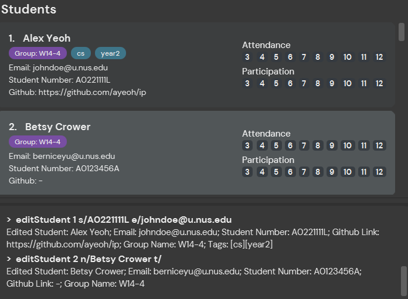
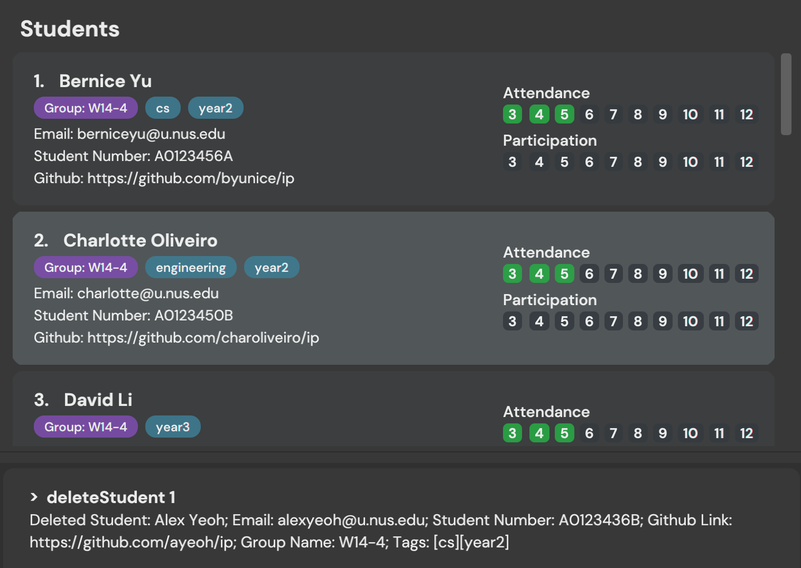
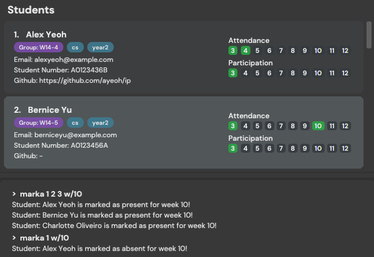
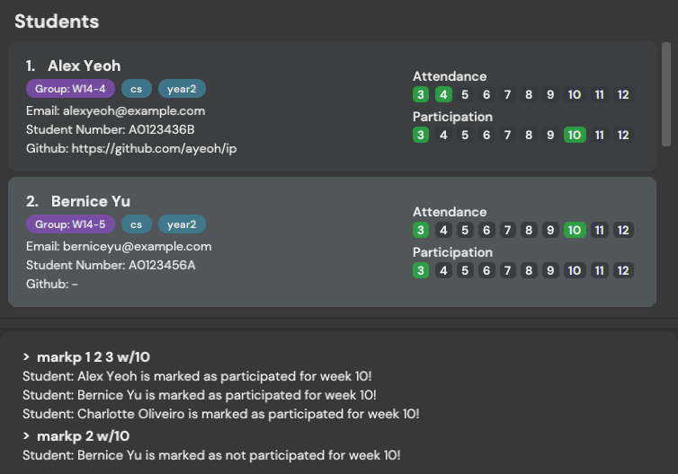
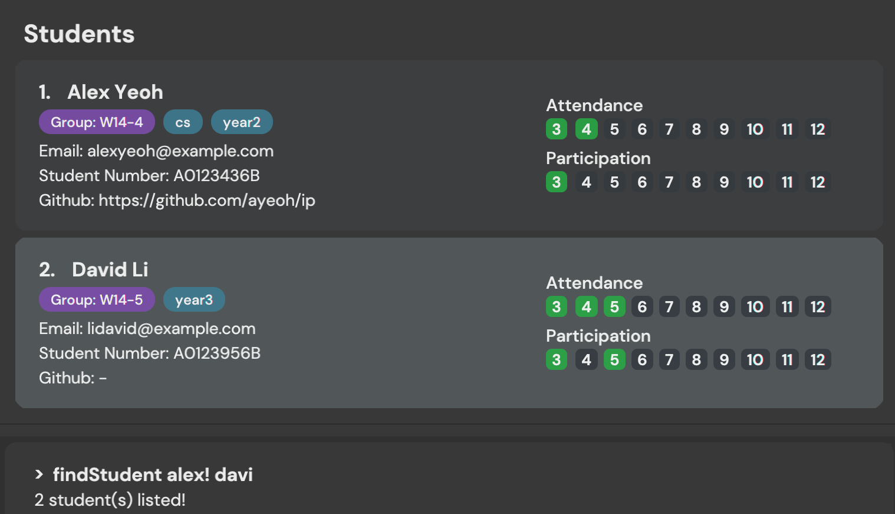
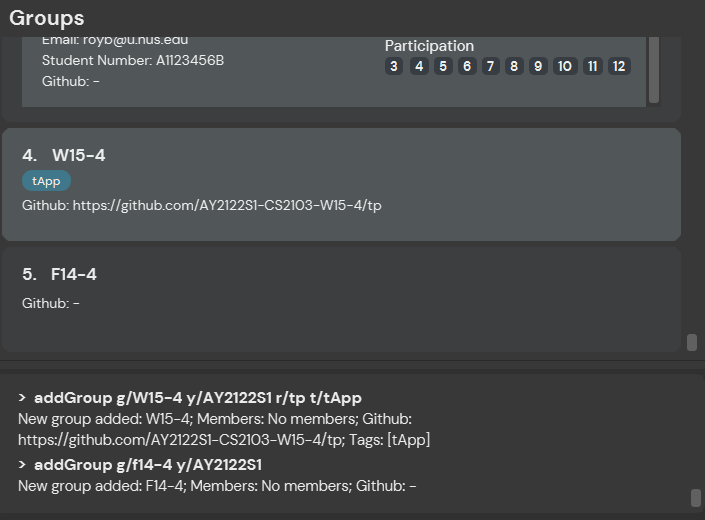
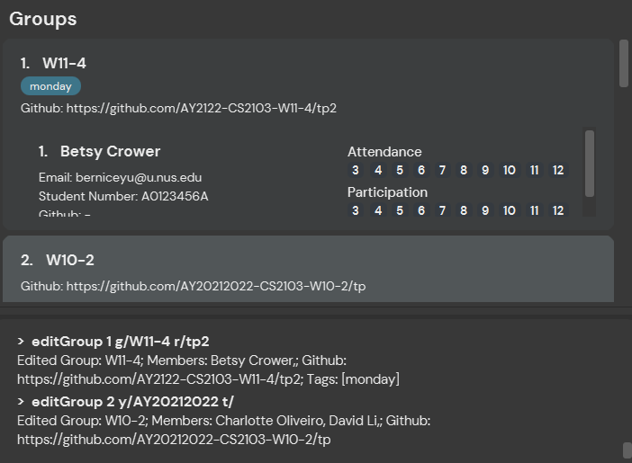
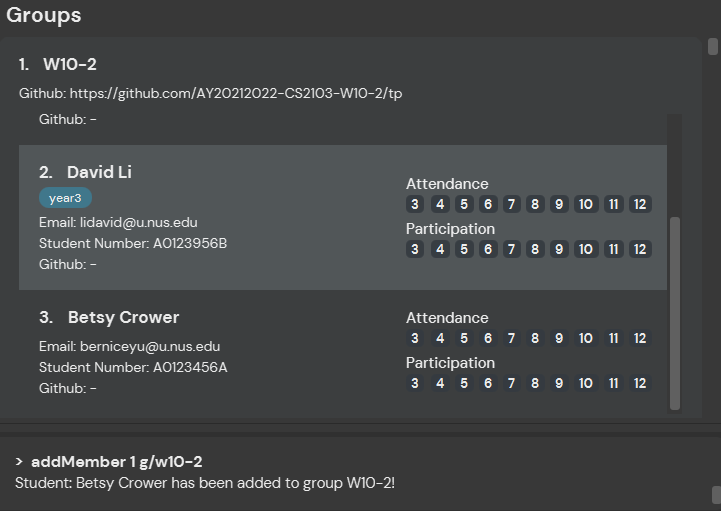
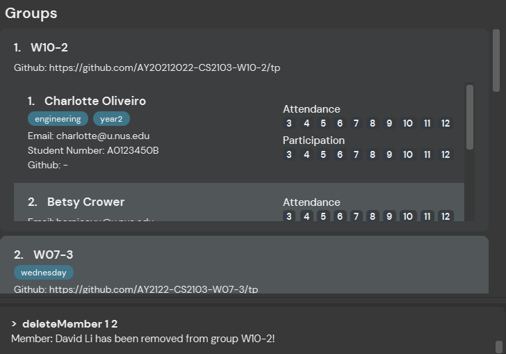
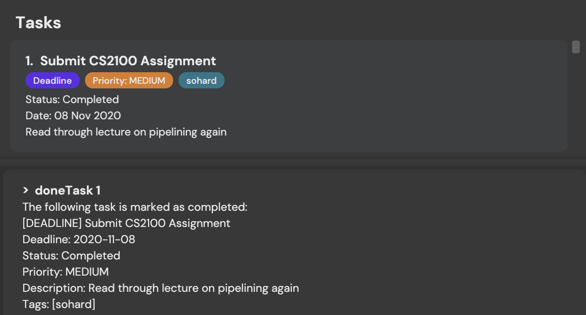

tApp is a **desktop app for managing tutorial groups and personal tasks, optimized for use via a Command Line Interface** (CLI). If you are a TA that is looking for an app that integrates different tools into a centralised platform and tracks your TA tasks, tApp is the app for you.

* Table of Contents
{:toc}

--------------------------------------------------------------------------------------------------------------------

# Quick start

1. Ensure you have Java `11` or above installed in your Computer.

1. Download the latest `tApp.jar` from [here](https://github.com/AY2122S1-CS2103-W14-4/tp/releases).

1. Copy the file to the folder you want to use as the _home folder_ for your tApp.

1. Double-click the file to start the app. The GUI similar to the below should appear in a few seconds. Note how the app contains some sample data. 
   

1. Type the command in the command box and press Enter to execute it. e.g. typing **`help`** and pressing Enter will open the help window. 
   Some example commands you can try:

    * **`students`** : Lists all students.

    * **`addStudent`**`n/Tom Lim e/tom@u.nus.edu s/A0123456B` : Adds a student named `Tom Lim` to the student list.

    * **`deleteStudent`**`3` : Deletes the 3rd student shown in the current list.

    * **`clearStudents`** : Deletes all students.

    * **`exit`** : Exits the app.

1. Refer to the [Features](#features) below for details of each command.

--------------------------------------------------------------------------------------------------------------------

# Features

**:information_source: Notes about the command format:** 

* Words in `UPPER_CASE` are the parameters to be supplied by the user. 
  e.g. in `addStudent n/NAME`, `NAME` is a parameter which can be used as `add n/John Doe`.

* Items in square brackets are optional. 
  e.g `n/NAME [t/TAG]` can be used as `n/John Doe t/cs` or as `n/John Doe`.

* Items with `…`​ after them can be used multiple times including zero times. 
  e.g. `[t/TAG]…​` can be used as ` ` (i.e. 0 times), `t/year2`, `t/year2 t/cs` etc.

* Parameters can be in any order. 
  e.g. if the command specifies `n/NAME s/STUDENT_NUMBER`, `s/STUDENT_NUMBER n/NAME` is also acceptable.

* If a parameter is expected only once in the command, but you specified it multiple times, only the last occurrence of the parameter will be taken. 
  e.g. if you specify `s/A0221393L s/A0114938H`, only `s/A0114938H` will be taken.

* Extraneous parameters for commands that do not take in parameters (such as `help`, `students`, `exit` and `clearStudents`) will be ignored. 
  e.g. if the command specifies `help 123`, it will be interpreted as `help`.

## Students
### List all students: `students`

Shows a list of all students inputted into tApp together with their attendance and participation scores for tutorials.

Format: `students`

Examples:
* `students` returns a list of all students with their information and attendance scores

### Add a student : `addStudent`

Adds a student to the student list.

Format: `addStudent n/NAME e/EMAIL s/STUDENTNUMBER [u/GITHUB USERNAME] [r/REPO NAME] [t/TAG]...`

* `NAME` should only contain alphabets and spaces.
* GitHub link will only be shown if both `GITHUB USERNAME` and `REPO NAME` are specified.
* `STUDENTNUMBER` must consist of a character, followed by 7 digits, followed by another character.
  Case of character does not matter.
* `EMAIL` must be of the form `local-part@domain` where
  * `local-part` should only contain alphanumeric characters and `+_.-`, and cannot start or end with `+_.-`.
  * `domain` is made up of `domain labels` separated by periods and must:
    - end with a `domain label` at least 2 characters long
    - have each `domain label` start and end with alphanumeric characters
    - have each `domain label` consist of alphanumeric characters, separated only by hyphens, if any
* If only either `GITHUB USERNAME` or `REPO NAME` are specified, the data will still be saved but not shown.
* If the same student is edited and the remaining empty data field is entered, a proper GitHub link will be shown.
* `TAG` has a character limit of 20 and must be alphanumeric with no spaces.

Examples:
* `addStudent n/John Doe e/johnd@u.nus.edu s/A0123456B u/user r/ip t/friends t/owesMoney` adds John Doe to the list
  and displays a confirmation output with a proper GitHub link
* `addStudent n/Bohn Doe e/bohnd@u.nus.edu s/A0123456C u/user` adds Bohn Doe to the list and displays a confirmation
  output without a proper GitHub link, but storing the `GITHUB USERNAME` in memory nonetheless.
  

### Edit a student : `editStudent`

Edits an existing student in the last displayed student list.

Format: `editStudent INDEX [n/NAME] [s/STUDENT_NUMBER] [e/EMAIL] [r/REPO_NAME] [u/USERNAME] [t/TAG]…​`

* Edits the student at the specified `INDEX`. The index refers to the index number shown in the displayed student list. The index **must be a positive integer** 1, 2, 3, …​
* At least one of the optional fields must be provided.
* Existing values will be updated to the input values.
* When editing tags, the existing tags of the student will be removed i.e adding of tags is not cumulative.
* You can remove all the student’s tags by typing `t/` without specifying any tags after it.
* This command flags out indexes less than 1 first, before missing fields, ensuring the validity of the fields, and finally the validity of index that is greater than 0. (If an invalid index greater than 0 is entered with no or wrong fields, the command would not check the validity of the index)

Examples:
* `editStudent 1 s/A0221111L e/johndoe@u.nus.edu` Edits the student number and email address of the 1st student to be `A0221111L` and `johndoe@u.nus.edu` respectively.
* `editStudent 2 n/Betsy Crower t/` Edits the name of the 2nd student to be `Betsy Crower` and clears all existing tags.
  
  
### Delete a student: `deleteStudent`

Deletes the specified student from the last displayed student list.

Format: `deleteStudent INDEX`

* Deletes the student at the specified `INDEX`.
* The index must refer to the index number shown in the last displayed students list.
* The index number must be a positive number: 1, 2, 3…
* Duplicate and multiple indexes are not allowed.

Examples:

* `students` followed by `deleteStudent 1` removes the 1st student in the students list.
  

### Marking a student's attendance: `marka`

Marks the specified student(s) in the last displayed student list as present or absent.

Format: `marka INDEX [MORE_INDEXES] w/WEEK_NUMBER`

* Marks the student(s) as present (or absent) in the specified `INDEX(ES)`.
* The index must refer to the index number shown in the last displayed students list.
* The index and week number must be a positive number, and must correspond to the tutorial weeks of the semester: 3, 4... 12.
* Duplicate indexes are not allowed.
* Only one week number should be specified after the `w/` prefix.
* If the student at the specified `INDEX` is marked as **present**, the command toggles the attendance to **absent**.
* If the student at the specified `INDEX` is marked as **absent**, the command toggles the attendance to **present**.

Examples:

* `students` followed by `marka 1 2 3 w/10` marks the 1st, 2nd and 3rd student in the students list as present in week 10.
* Another `marka 1 w/10` instance will mark the 1st student in the student list as absent in week 10.
  

### Marking a student's participation: `markp`

Marks the specified student(s) in the last displayed student list as participated or not participated.

Format: `markp INDEX [MORE_INDEXES] w/WEEK_NUMBER`

* Marks the student(s) as participated in the specified `INDEX` for that week.
* The index must refer to the index number shown in the last displayed students list.
* The index and week number must be a positive number, and must correspond to the tutorial weeks of the semester: 3, 4... 12.
* Duplicate indexes are not allowed.
* Only one week number should be specified after the `w/` prefix.
* If the student at the specified `INDEX` is marked as **participated**, the command toggles the participation to not **not participated**.
* If the student at the specified `INDEX` is marked as **not participated**, the command toggles the participation to not **participated**.

Examples:

* `students` followed by `markp 1 2 3 w/10` marks the 1st, 2nd and 3rd student in the students list as participated in week 10.
* Another `markp 2 w/10` instance will mark the 1st student in the student list as not participated in week 10.
  

### Find student by name: `findStudent`

Finds students whose names contain any of the given keywords.

Format: `findStudent KEYWORD [MORE_KEYWORDS]`

* The search is case-insensitive. e.g `hans` will match `Hans`
* The order of the keywords does not matter. e.g. `Hans Bo` will match `Bo Hans`
* Only the name is searched.
* Numbers and special characters will be ignored e.g. `Alice!` will match `Alice`
* Partial names will be matched e.g. `Han` will match `Hans`
* Students matching at least one keyword will be returned (i.e. `OR` search).
  e.g. `Hans Bo` will return `Hans Gruber`, `Bo Yang`

Examples:
* `findStudent Joh@` returns `john` and `John Doe`, if there are students named 'john' and 'John Doe'
* `findStudent alex! davi` returns `Alex Yeoh`, `David Li`, if there are students named 'Alex Yeoh' and 'David Li' 
  
  
### Clearing all entries from student list: `clearStudents`

Clears all entries from the student list.

Format: `clearStudents`

-----

## Groups
### List all groups: `groups`

Shows a list of all groups inputted into tApp together with its group members and group GitHub link if any are added.

Format: `groups`

Examples:
* `groups` returns a list of all groups with their information.

### Add a group: `addGroup`

Adds a group to the group list. No members will be initialized. 

Format: `addGroup g/GROUP_NAME [r/REPO_NAME] [y/YEAR] [t/TAG]...`

* Similar to `addStudent`, GitHub link will only be shown if both `YEAR` and `REPO NAME` are specified, but either field will still be saved if specified alone.
* `GROUP_NAME` must be contain a character, followed by 2 digits, a dash (-), followed by another digit.
  The case of the character does not matter.
* `YEAR` represents the year field used in CS2103 GitHub links and not an actual calendar year. Input is therefore flexible to allow for changes in year formatting 
* `TAG` has a character limit of 20 and must be alphanumeric with no spaces. 

Examples:
* `addGroup g/W15-4 y/AY2122S1 r/tp t/tApp` adds group W15-4 to the list and displays a confirmation output with GitHub link and no
  group members
* `addGroup g/f14-4 y/AY2122S1` adds group F14-4 to the list and displays a confirmation output with no GitHub link and group members
  
  
### Editing a group : `editGroup`

Edits a group from the last displayed group list.

Format: `editGroup INDEX [g/GROUP_NAME] [r/REPO_NAME] [y/YEAR] [t/TAG]…​`

* Edits the group at the specified `INDEX`.
* The index refers to the index number shown in the last displayed group list.
* The index **must be a positive integer** 1, 2, 3, …​
* At least one of the optional fields must be provided.
* Existing values will be updated to the input values.
* When editing tags, the existing tags of the group will be removed i.e adding of tags is not cumulative.
* You can remove all the group’s tags by typing `t/` without specifying any tags after it.
* Similar to `editStudent` this command flags out index values less than 1 first, before missing fields, ensuring the validity of the fields, and finally the index that is greater than 0.

Examples:
* `editGroup 1 g/W11-4 r/tp2` Edits the group name and repository name of the 1st group to be `W11-4` and `tp2` respectively.
* `editGroup 2 y/AY20212022 t/` Edits the name of the 2nd group to be `AY20212022` and clears all existing tags.
  

### Delete a group: `deleteGroup`

Deletes the specified group from the last displayed group list.

Format: `deleteGroup INDEX`

* Deletes the student at the specified `INDEX`.
* The index refers to the index number shown in the last displayed group list.
* The index must be a positive integer 1, 2, 3, …​
* Duplicate and multiple indexes are not allowed.

Examples:
* `deleteGroup 1` deletes the group with index 1 in group list and displays a confirmation output with the group members and GitHub link of the group deleted.
  
  
### Add a student to a group: `addMember`

Adds a student in the last displayed student list to an existing group in the group list.

Format: `addMember INDEX g/GROUP`

* Adds the student specified at `INDEX` to the group with name specified by `GROUP`.
* The index refers to the index number shown in the last displayed student list.
* The index must be a positive integer 1, 2, 3, …​
* `GROUP` must be an existing group in the group list.

Examples:
* `addMember 1 g/W10-2` adds the student with index 1 in the student list to group W10-2 and displays a confirmation output that the student has been added to the group.
  

### Delete a student from a group: `deleteMember`

Deletes the specified member from the last displayed group list.

Format: `deleteMember GROUP_INDEX STUDENT_INDEX`

* Deletes the student at the specified `STUDENT_INDEX` in the group at the specified `GROUP_INDEX`.
* The indexes refer respectively, to the index number shown in the last displayed group list and group member list.
* The indexes must be a positive integer 1, 2, 3, …​

Examples:
* `deleteMember 1 2` deletes the member with index 2 in the group member list of the group with index 1 in group list and displays a confirmation output with the affected group member and group name.
  

### Locating group by name: `findGroup`

Find groups whose names contain any of the given keywords.

Format: `findGroup KEYWORD [MORE_KEYWORDS]`

* The search is case-insensitive. e.g `w14-4` will match `W14-4`
* The order of the keywords does not matter. e.g. `w14 w15` will match `w15 w14`
* Only the group name is searched.
* All special characters except dashes (`-`) will be ignored e.g. `w14!` will match `w14`
* Partial group names will be matched e.g. `w14` will match `w14-4`
* Groups matching at least one keyword will be returned (i.e. `OR` search).
  e.g. `w14 w15` will return `w14-4`, `w14-3`, `w15-1`

Examples:
* `findGroup w14` returns `W14-3` and `W14-4`
* `findGroup w14 w15` returns `W14-3`, `W14-4`, `W15-2` 
  
  
### Clearing all entries from group list: `clearGroups`

Clears all entries from the group list.

Format: `clearGroups`

-----

## Tasks
### List all tasks: `tasks`

Displays all the tasks currently in the task list.
All tasks are sorted with completed tasks at the bottom of the list.
Pending tasks are then sorted by their associated dates, with those with the earliest date at the top of the list. `TodoTask`s, which do not have a date, are placed at the bottom of the list.
Tasks that have the same associated date are then sorted by their priority level, with the highest priority level at the top.

Format: `tasks`

### Add a todo task: `todo`

Adds a todo task.

Format: `todo n/TASK_NAME [d/DESCRIPTION] [p/TASK_PRIORITY] [t/TAG]…​`

* Adds a todo task with the specified `TASK_NAME`
* The possible priorities are High, Medium and Low.
* `p/H` marks a task as High Priority, `p/M` marks a task as Medium Priority, `p/L` marks a task as Low Priority.
* The priority parameter accepts partial words and is case-insensitive.
* A combination of different priority levels are not accepted.
* Tasks that are not specified a priority level will be by default Low Priority.
* `DESCRIPTION` should only contain ASCII characters.
* `TAG` has a character limit of 20 and must be alphanumeric with no spaces.

Examples:
* `todo n/play` creates the todo task "play" with the default LOW Priority.
* `todo n/study p/H` creates the todo task "study" and marks it as HIGH Priority.
* `todo n/CS2103 d/Prepare for Tutorial p/M` creates the todo task "CS2103" with the description
  "Prepare for tutorial" and with MEDIUM Priority.
* `todo n/Complete tP d/Last chance to add features t/CS2103 t/work p/H` creates a todo task 'Complete tP'
  with the description "Last chance to add features" and tags "CS2103" & "work" with High Priority.

### Add an event task: `event`

Adds an event task with the given event date.

Format: `event n/TASK_NAME on/EVENT_DATE [d/DESCRIPTION] [p/TASK_PRIORITY] [t/TAG]…​`

* Adds an event task with the specified `TASK_NAME`
* The event task has the taskDate `DATE`
* The taskDate must be in the format `YYYY-MM-dd`
* Priority, description and tags are similar to [**Todo Task**](#add-a-todo-task-todo).

Examples:
* `event n/Party on/2021-09-23 p/M` creates the event task "party", on "2021-09-23" with
  Medium Priority.
* `event n/Exam on/2021-10-04` creates the event task "exam", on "2021-10-04", with Low Priority.

### Add a deadline task: `deadline`

Adds a deadline task with a specified deadline.

Format: `event n/TASK_NAME by/DEADLINE [d/DESCRIPTION] [p/TASK_PRIORITY] [t/TAG]…​`

* Adds a deadline task with the specified `TASK_NAME`
* The deadline task has the task date `DEADLINE`
* The taskDate must be in the format `YYYY-MM-dd`
* Priority, description and tags are similar to [**Todo Task**](#add-a-todo-task-todo).

Examples:
* `deadline n/tutorial participation by/2021-09-23 p/H` creates the deadline task "tutorial participation",
  with deadline "2021-09-23" with HIGH Priority.
* `deadline n/assignment submission by/2021-10-04` creates the deadline task "assignment submission",
  with the deadline "2021-10-04" with LOW Priority.

### Editing a task: `editTask`

Edits an existing task in the tasks list.

Format: `editTask INDEX [n/NAME] [d/DESCRIPTION] [p/PRIORITY] [t/TAG]…​`

* Edits the task at the specified `INDEX`. The index refers to the index number shown in the displayed task list.
* The index **must be a positive integer** 1, 2, 3, …​
* Command can be used to edit any of the three types of tasks: `todo`, `event` and `deadline`
* At least one of the optional fields must be provided.
* Existing values will be updated to the input values.
* If the task being edited is an `event`, the date of the event can be edited by applying the `on/` flag followed by a new date. i.e `editTask INDEX on/DATE`. The `on/` flag is invalid for other types of tasks.
* If the task being edited is a `deadline`, the date of the deadline can be edited by applying the `by/` flag followed by a new date. i.e `editTask INDEX by/DATE`. The `by/` flag is invalid for other types of tasks.
* When editing tags, the existing tags of the student will be removed i.e adding of tags is not cumulative.
* You can remove all the task’s tags by typing `t/` without specifying any tags after it.

Examples:
* `editTask 1 n/Tutorial Preparation d/Presentation p/medium` Edits the name, description and priority of the 1st task to be `Tutorial Preparation`, `Presentation` and `medium` respectively.
* `editTask 2 n/Final Examination on/2021-10-12 t/` Edits the name and date of the 2nd task to be `Final Examination` and `2021-10-12`, and clears all existing tags.

### Deleting a task: `deleteTask`

Deletes the specified task from the task list.

Format: `deleteTask INDEX`

* Deletes the task at the specified `INDEX`.
* The index must refer to the index number shown in the displayed task list.
* The index and week number must be a positive number: 1, 2, 3…

Examples:

* `deleteTask 1` removes the 1st task in the task list.

### Marking a task as done: `doneTask`

Mark the specified task(s) in the task list as completed or pending.

Format: `doneTask INDEX [MORE_INDEXES]`

* The index refers to the index number shown in the task list.
* The user is able to mark multiple tasks by providing multiple indexes.
* The indexes must be a positive integer 1, 2, 3, ...
* Duplicate indexes are not accepted.
* If the task at the specified `INDEX` is marked as pending, using `doneTask INDEX` will mark it as complete.
* If the task at the specified `INDEX` is marked as complete, using `doneTask INDEX` will mark it as pending.

Examples:
* `doneTask 2` marks the 2nd task in the task list as completed or pending.
* `doneTask 1 3 4` marks the 1st, 3rd and 4th tasks in the task list as completed or pending.

### Clearing all entries from task list: `clearTasks`

Clears all entries from the task list.

Format: `clearTasks`

---

## Clearing all entries from tApp: `clearAll`

Clears all entries from tApp.

Format: `clearAll`

## Viewing help : `help`

Shows a popup with all the available commands.

Format: `help`

## Exiting the program : `exit`

Exits the program.

Format: `exit`

## Saving the data

tApp data are saved in the hard disk automatically after any command that changes the data. There is no need to save manually.

## Editing the data file

tApp data are saved as a JSON file `[JAR file location]/data/tApp.json`. Advanced users are welcome to update data directly by editing that data file.

:exclamation: **Caution:**
If your changes to the data file makes its format invalid, tApp will discard all data and start with an empty data file at the next run.

--------------------------------------------------------------------------------------------------------------------

## FAQ

**Q**: How do I transfer my data to another Computer? 
**A**: Install the app in the other computer and overwrite the empty data file it creates with the file that contains the data of your previous tApp home folder.

--------------------------------------------------------------------------------------------------------------------

# Command summary

## [Students](#students)

Commands | Format | Examples
--------|------------------------|-----
[**List Students**](#list-all-students-students) | `students` | 
[**Add Student**](#add-a-student--addstudent) | `addStudent n/NAME s/STUDENT_NUMBER e/EMAIL  [t/TAG]…​` | e.g., `addStudent n/Clara Ng s/A0221111W e/clara@u.nus.edu` 
[**Edit Student**](#edit-a-student--editstudent) | `editStudent INDEX [n/NAME] [s/STUDENT_NUMBER] [e/EMAIL] [r/REPO NAME] [u/USERNAME] [t/TAG]…​` | e.g., `editStudent 1 s/A0221111L e/johndoe@u.nus.edu`
[**Delete Student**](#delete-a-student-deletestudent) | `deleteStudent INDEX` | e.g., `deleteStudent 1`
[**Mark Student Attendance**](#marking-a-students-attendance-marka) | `marka INDEX w/WEEK` | e.g., `marka 1 w/10`
[**Mark Student Participation**](#marking-a-students-participation-markp) | `markp INDEX w/WEEK` | e.g., `markp 1 w/10`
[**Find Student**](#find-student-by-name-findstudent) | `findStudent KEYWORD [MORE_KEYWORDS]` | e.g., `findStudent David`
[**Clear Students**](#clearing-all-entries-from-student-list-clearstudents) | `clearStudents`

## [Groups](#groups)

Commands | Format | Examples
--------|------------------------|-----
[**List Groups**](#list-all-groups-groups) | `groups`
[**Add Group**](#add-a-group-addgroup) | `addGroup g/NAME [y/YEAR] [r/REPO NAME] [t/TAG]…​` | e.g., `addGroup g/W14-5 r/tp y/AY20222023`
[**Edit Group**](#editing-a-group--editgroup) | `editGroup INDEX [g/NAME] [r/REPO NAME] [y/Year] [t/TAG]…​` | e.g., `editGroup 2 g/W14-4 r/tp y/AY20212022`
[**Delete Group**](#delete-a-group-deletegroup) | `deleteGroup INDEX` | e.g., `deleteGroup 1`
[**Add Student to Group**](#add-a-student-to-a-group-addmember) | `addMember INDEX g/GROUP` | e.g., `addMember 2 g/W14-4`
[**Delete Student from Group**](#delete-a-student-from-a-group-deletemember) | `deleteMember GROUP_INDEX STUDENT_INDEX` | e.g., `deleteMember 2 1`
[**Find Group**](#locating-group-by-name-findgroup) | `findGroup KEYWORD [MORE_KEYWORDS]` | e.g., `findGroup W15-5`
[**Clear Groups**](#clearing-all-entries-from-group-list-cleargroups) | `clearGroups`

## [Tasks](#tasks)

Commands | Format | Examples
--------|------------------------|-----
[**List Tasks**](#list-all-tasks-tasks) | `tasks`
[**Add Todo Task**](#add-a-todo-task-todo) | `todo n/TASK_NAME [t/TAG]…​` | e.g., `todo n/tP t/CS2103`
[**Add Event Task**](#add-an-event-task-event) | `event n/TASK_NAME on/DATE [t/TAG]…​` | e.g., `event n/Final Exam on/2021-10-31 t/CS2103`
[**Add Deadline Task**](#add-a-deadline-task-deadline) | `deadline n/TASK_NAME by/DEADLINE [t/TAG]…​` | e.g., `deadline n/Finish tP by/2021-10-31 t/W14-4`
[**Edit Task**](#editing-a-task-edittask) | `editTask INDEX [n/TASK_NAME] [by/DATE] [t/TAG]…​`| e.g.,`editTask 2 n/study by/2012-10-31 t/W14-4`
[**Delete Task**](#deleting-a-task-deletetask) | `deleteTask INDEX`| e.g., `deleteTask 3`
[**Mark Done Task**](#marking-a-task-as-done-donetask) | `doneTask INDEX [MORE INDEXES]` | e.g., `doneTask 1 2 3`
[**Clear Tasks**](#clearing-all-entries-from-task-list-cleartasks) | `clearTasks`

## General

Action | Format, Examples
--------|-----------------------------
[**Clear Address Book**](#clearing-all-entries-from-tapp-clear) | `clearAll`
[**Help**](#viewing-help--help) | `help`
[**Exit**](#exiting-the-program--exit) | `exit`
